

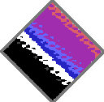

# ClashState

VERSION 0.8

(c)2020-2024 By Pablo Roldán(Durandal)

---
# Table of contents

1. Introduction
2. Features

---

# 1 Introduction

*ClashState* is an image converter which allows to convert JPEG, GIF and PNG images to the native formats of 8-bit computers.

The software is written in Python and uses _DearPyGUI_ for the GUI.

The conversion algorithm started as a module I developed for [RetroBBS](https://github.com/retrocomputacion/retrobbs), it makes use of *HitherDither* de *Henrik Blidh* (with some changes), Pillow and Kmeans via OpenCV.

# 2 Features

### Supports the following graphic modes:

   - **Commodore 64 HiRes**: 320×200 pixels 16 colors – 2 colors per 8×8 pixels attribute.
   - **Commodore 64 Multicolor**: 160×200 pixels 16 colors – 4 colors per 4×8 pixels attribute, 1 of them fixed for the whole image.
   - **Commodore 64 AFLI**: 296×200 pixels 16 colors – 2 colors per 8×1 pixels attribute.
   - **Commodore 64 Unrestricted**: Fantasy mode, 320×200 pixels 16 colors, no restrictions.
   - **Commodore Plus/4 HiRes**: 320x200 pixels 121 colors - 2 colors per 8x8 pixels attribute.
   - **Commodore Plus/4 Multicolor**: 160x200 pixels 121 colors - 4 colors per 4x8 pixels attribute, 2 of them fixed for the whole image.
   - **Commodore Plus/4 Unrestricted**: Fantasy mode, 320x200 pixels 121 colors, no restrictions.
   - **MSX 1 Screen 2**: 256×192 pixels 15 colors – 2 colors per 8×1 pixels attribute.
   - **MSX 1 Unrestricted**: Fantasy mode, 256×192 pixels 15 colors, no restrictions.
   - **ZX Spectrum**: 256×192 pixels 15 colors – 2 colors per 8×8 pixels attribute.
   - **ZX Spectrum Unrestricted**: Fantasy mode, 256×192 pixels 15 colors, no restrictions.

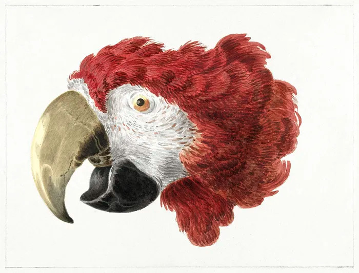 Original - Macaw - Aert Schouman
| | |
|:---:|:---:
| C64 Hires|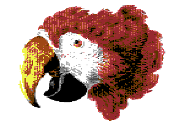 C64 Multicolor
|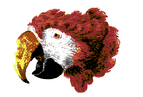 C64 AFLI| C64 Unrestricted
| Plus/4 Hires|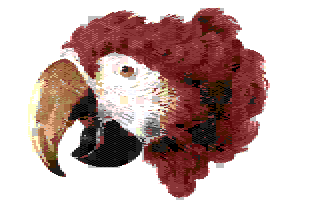 Plus/4 Multicolor
|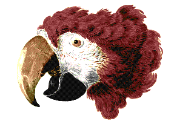 Plus/4 Unrestricted|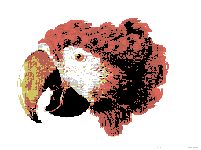 MSX1 Unrestricted
| MSX1 Unrestricted| ZX Spectrum
|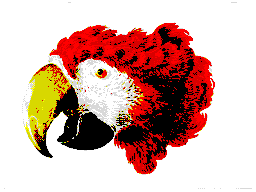 ZX Spectrum Unrestricted

Free positioning and scaling of the input image: Click and drag the input image to set the position/cropping. Use your mouse wheel for zooming.

### Real time adjustment of:

   - Contrast
   - Brightness
   - Hue
   - Saturation
   - Sharpness

### Dithering, color quantization:

   - 2-step quantization: luminance and final. The optional luminance step is applied only over the input image luminance channel and either the selected color palette’s luminance channel or over black and white.
   - Ten types of dithering/quantization:
     -   None: Nearest color, or no effect when selected for the luminance step
     -   Bayer 2×2
     -   Bayer 4×4
     -   Bayer 4×4 (Odd)
     -   Bayer 4×4 (Even)
     -   Bayer 4×4 (Spotty)
     -   Bayer 8×8
     -   Yliluoma
     -   Cluster dot
     -   Floyd Steinberg
    
   - With the exception of Yliluoma and Floyd Steinberg, the quantization threshold can be adjusted from 1 (darker) to 5 (lighter).

 

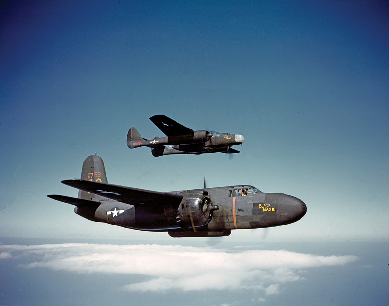 Original - P-61 y A-20 (Source: Smithsonian National Air and Space Museum)
| | |
|:---:|:---:
| 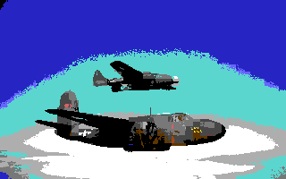 C64 Hires None | 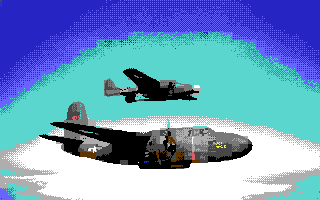 C64 Hires Bayer 2x2
| 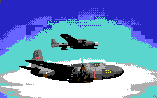 C64 Hires Bayer 4x4 | 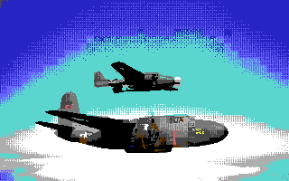 C64 Hires Bayer 4x4 Even
|  C64 Hires Bayer 4x4 Odd |  C64 Hires Bayer 4x4 Spotty
| 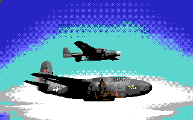 C64 Hires Bayer 8x8 | 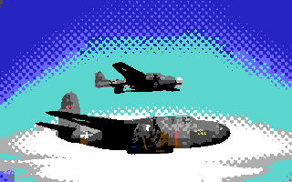 C64 Multicolor Cluster
| 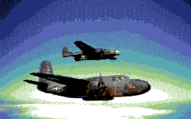 C64 Multicolor Yliluoma | 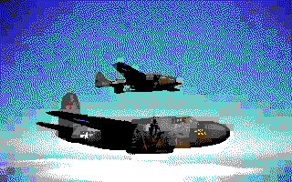 C64 Hires Floyd Steinberg

   - Selection for _Euclidean distance_, _CCIR 601_ or _LAb delta CIEDE 2000_ color comparison (found in the Options menu). Ylilouma and Floyd Steinberg use their own methods.

.jpg) Original - Endeavour - Steve Jurvetson
| | |
|:---:|:---:
| MSX1 Euclidean distance | MSX1 CCIR 601
| MSX CIEDE 2000

### Color Palettes:

   - Quantization and preview palettes can be independently selected
    Each color in the palette can be enabled/disabled individually, for fine tuning the conversion result.
   - When enabling only 2 colors the quantization can be made over the selected color values or, use black and white for the quantization palette and the selected colors for the final image render.

 Original - Paul Cignac - Saint Tropez
| | |
|:---:|:---:|
|  MSX full palette |  MSX 5 active colors
|  MSX only purple and grey active |  MSX only purple and grey active, b&w mode

### Output formats:

   - Commodore 64 Hires:
     - Art Studio
     - C64 executable
     - PNG
   - Commodore 64 Multicolor:
     - Koala Paint
     - C64 executable
     - PNG
   - Commodore 64 AFLI:
     - AFLI editor
     - C64 executable
     - PNG
   - Commodore 64 unrestricted:
     - PNG
   - Commodore Plus/4 Hires:
     - Botticelli
     - Commodore Plus/4 executable
     - PNG
   - Commodore Plus/4 Multicolor:
     - Multi Botticelli
     - Commodore Plus/4 executable
     - PNG
   - Commodore Plus/4 unrestricted:
     - PNG
   - MSX1 Screen 2:
     - Screen 2
     - PNG
   - MSX1 unrestricted:
     - PNG
   - ZX Spectrum:
     - ZX Spectrum screen (.scr)
     - PNG
   - ZX Spectrum unrestricted:
     - PNG
     